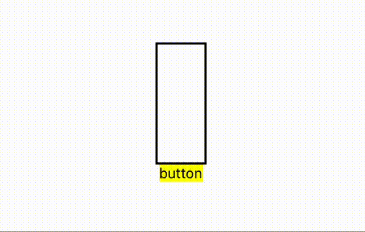

# react-native-flying-objects

flying objects package for react native

## INSTALLATION

`npm install --save react-native-flying-objects`

## HOW TO USE

import react-native-flying-objects.

```js
import FlyingView from 'react-native-flying-objects';
```

add properties for modify FlyingView.

- manage state for flying objects

  ```js
  const [object, setObject] = useState<ObjectConfig[]>([]);
  // manage every rendering objects
  ```

- when you want to add object just add more state

  ```js
  setObject((prev) => [...prev, newObject]);
  // the new object added
  ```

- add FlyingView where you want to use.

  ```js
  return (
    <FlyingView
      object={object}
      containerProps={{ style: { borderWidth: 2, borderColor: 'black' } }}
    >
      <Text>hello</Text>
    </FlyingView>
  );
  // text "hello" will be the object that flying
  ```

- result
  

## PROPERTIES

### FlyIngView

| Property       | required | Type            | Description                                         | DefaultValue                                         |     |
| -------------- | -------- | --------------- | --------------------------------------------------- | ---------------------------------------------------- | --- |
| chlidren       | true     | React.ReactNode | A template for creating a flying object.            | none                                                 |     |
| object         | true     | ObjectConfig    | list of objects manages by View.                    | undefined                                            |     |
| containerProps | false    | ViewProps       | Props for the container in which the object floats. | {pointerEvents:"none",style={{width:50,height:120}}} |

## TYPES

types for use FlyingView

```js
interface AnimatedObject {
  fromValue?: number;
  toValue?: number;
  duration?: number;
  easing?: ((value: number) => number) | undefined;
  delay?: number;
}

interface ObjectConfig {
  right?: AnimatedObject;
  top?: AnimatedObject;
  show?: AnimatedObject;
  hide?: AnimatedObject;
}
```
